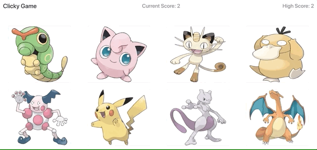

# Pokemon Clicky Game

## https://loganrdj.github.io/ClickyGame/

This is a fun little mini game that was created with ReactJS. The goal here is to click as many individual Pokemon without clicking duplicates! If you happen to click a pokemon that you've already clicked previously, you will lose! Good luck!

## Software used
- ReactJS
- Node
- Bootstrap
- npm - shuffle-array
